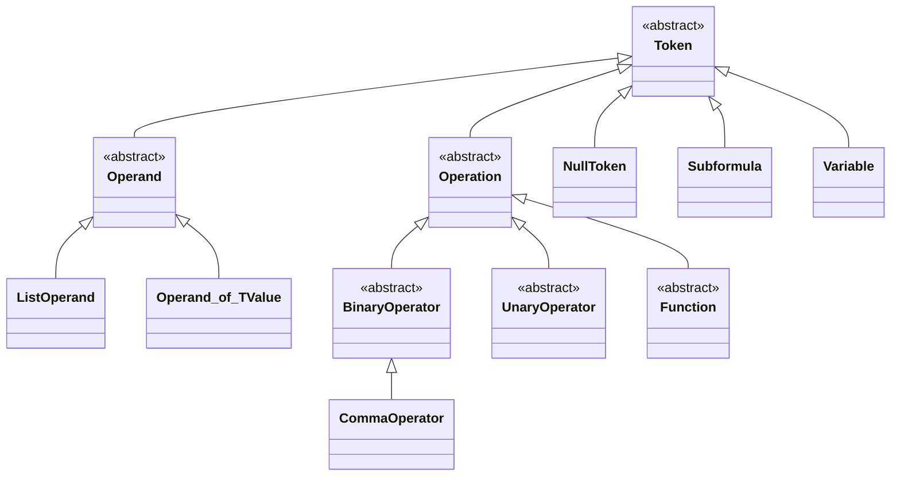

# About Calculator

This project is implementation of calculator.

Main features:
* 4 types of brackets: (), [], {}, <>
* it is possible to add new operations and operand types
* variables are supported

# Project Structure

The project consists of 3 packages:
* Calculator.Core: contains classes and interfaces which are a heart of the calculator
* Calculator.Core.DependencyInjection: provides handy way to register calculator stuff in .net dependency injection mechanism
* Calculator.Extra: classes that provide some operators, functions and operand types along with parsers for them

# Using Calculator

## Terminology

**Formula** is a string that needs to be calculated. It is parsed into series of **tokens**. There are several types of tokens:
* **operation** can be operator (binary or unary) or function (e.g., "**min**(1, 2, 3)")
* **operand** is argument for operation
* **null token** is result of empty formula or subformula
* **subformula** is part of formula enclosed into brackets of one type  
it should be a valid formula by itself  
it can contain nested subformulas
* **variable** is a reference to operand which is passed along with formula

Unary and binary operators can use the same text as they cannot appear in the same context. Unary operators can be used at the beginning of formula and after binary or unary operators, whereas binary operator can be used only after operand, variable or subformula.

## Out-of-the-box Functionality

Out-of-the-box calculator supports list, decimal and boolean operands.

Operators:
* decimal operators: +, -, /, *
* boolean operators: &&, ||, !

Functions:
* ceil
* floor
* min
* max

## Extending Calculator

Core classes:

\* `Operand_of_TValue` is indeed `Operand<TValue>`, but mermaid does not support 2 classes that differ only by generic part

As discovered operations are executed taking priority and left-to-right-ness of operations into consideration. Subformulas and variables are resolved once they are discovered.

To add new operand type, you need to inherit your class from `Calculator.Core.Tokens.Operand` and provide parser that can find your operands.

You can also add new operations by extending `Calculator.Core.Tokens.BinaryOperator`, `Calculator.Core.Tokens.UnaryOperator` or `Calculator.Core.Tokens.Function`.

Example of extending calculator with new operation and parser can be found in `Calculator.Samples.ExtendingCalculator` project.

`CommaOperator` is implemented as an operator which creates `ListOperand` of its left and right arguments. This makes it possible to pass multiple arguments to functions. Also this mechanism might be used for implementing vector operations.

# Further Improvements

## Add Tests for Dependency Injection Project

Add tests for Calculator.Core.DependencyInjection.

## Priority

There is no way to change priority of operators you use from `Calculator.Extra` library (or you own library). For example, if you want to add new operator that has priority between logical And `&&` and Or `||` operators, you cannot do that.

Another improvement regarding priority is to extract operations priorities out of operations, because it does not make sense to have 2 same operation instances with different priorities.

## Variable Resolving

Variables are resolved during parsing the formula. It might make sense to postpone variable value resolution to moment when it's needed. Doing so will result in splitting calculation process into 2 steps: 1) parsing formula which leads to creating of some structure that holds operations and their operands and 2) calculation itself - determining the value of formula. This approach allows "pre-compiling" the formula, thus caching parsed result and reusing it with different variable values.

## Dependency Injection Validation

Do not allow multiple operations be registered with the same text.

## Allow Operations Start with Same Text

For example, it should be possible to register operators "*" and "**".

## Allow Operator Overloading

There is a good reason to use same sign for operator on different arguments. This can be solved using inheritance, but there should be a way to register only one of the implementations.
